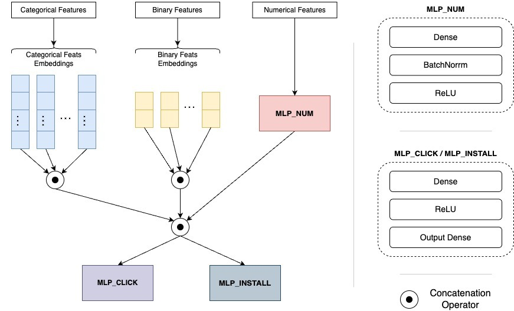

# 2023 Recsys Challenge
This repository contains **ctr_superstar_🦹🏽‍♂️** solution to RecSys Challenge 2023 organized by ShareChat (http://www.recsyschallenge.com/2023/). Please refer to the website link to know about the problem statement and more details about the dataset.


## Environment Setup:
TO install all dependencies run the below command
```
pip install -r requirements.txt
```

## Dataset:
Download the dataset from the official website and place it in the `data` directory. Then, unzip the dataset files.

## Our solution:
Please refer to the `train_v1.ipynb` notebook where we have mentioned about what all operations we did in data processing and feature engineering along with our model architecture.


## Model Architecture :



<br/>


## Team Members:

* Animesh Sahoo
* [Bharat Ladrecha](https://www.github.com/Bh4r4t)
* Devendra Singh